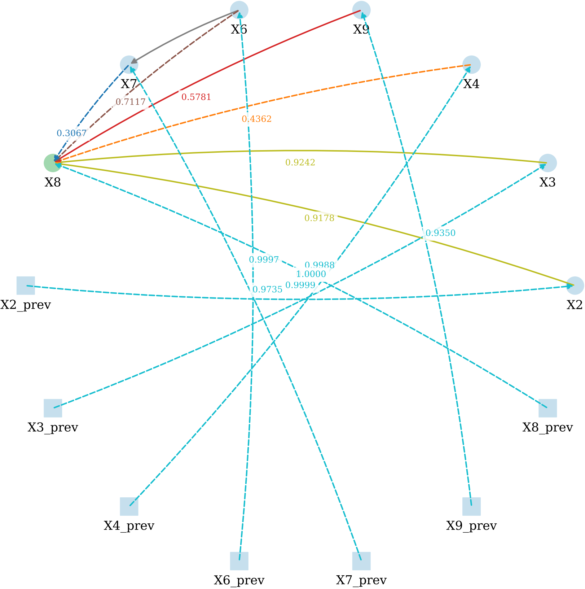
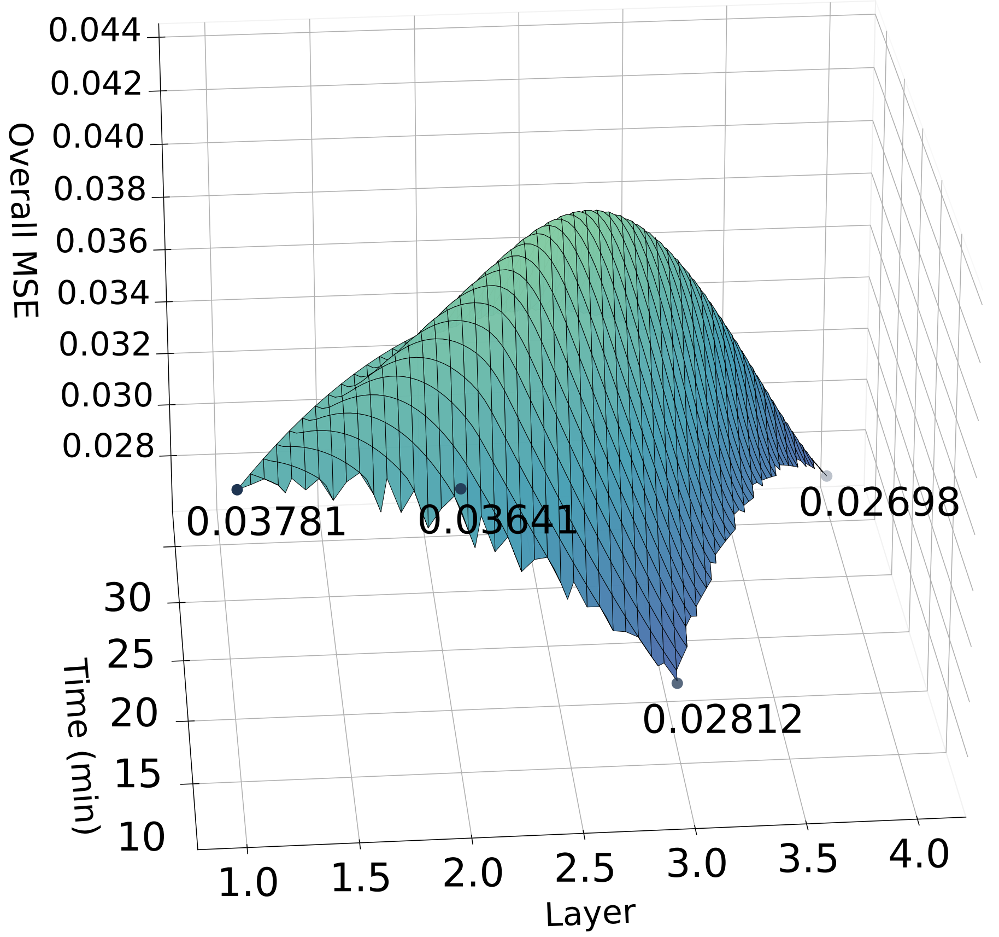

# CATGCN

**CATGCN: Cross-step Physics-aware Temporal Graph Neural Networks for Biopharma Process Modeling**

CATGCN is a physics-aware temporal graph neural network designed for modeling biopharmaceutical processes. It introduces a cross-step temporal graph mechanism that incorporates physical priors derived from ODEs (Ordinary Differential Equations), enabling accurate long-term dynamic prediction in real-world fermentation systems.


---

## 🔧 Key Modules

### STGDEncoder
A general encoder that constructs cross-timestep spatial-temporal graphs from physical knowledge (ODEs).  
- Can be plugged into any spatial-temporal GNN architecture.  
- Supports user-defined physical edges across time.  
- Examples are provided in the `STGDEncoder_examples/` directory, codes are available in STGDEncoder_tools/` folder.

### CORREncoder
A correction module that learns feedback from prediction errors to enhance long-term accuracy.  
- Improves robustness by correcting deviations.  
- Compatible with CATGCN or other GNNs.
- Archs are available in CORREncoder_arch/` folder.


### Real_studys
Includes real-world fermentation cases:  
- Penicillin G production modeling.
 
- Erythromycin A production modeling.
 
- All cases are available in the `Real_studys/` folder.

---

## 📊 Experimental Results



CATGCN achieves state-of-the-art performance on real-world datasets, more details can be found in the paper📚.

---

## 🚀 Getting Started

```bash
# 1. Clone the repository
git clone https://github.com/yourname/CATGCN.git
cd CATGCN

# 2. Install dependencies


# 3. Run a demo: build a physical STG graph
cd STGDEncoder_examples
python build_graph_example.py
```

---

## 📁 Repository Structure

```
CATGCN/
├── STGDEncoder_tools/         # Cross-timestep physical graph constructor
├── STGDEncoder_examples/      # Demo scripts to build STGs
├── Real_studys/               # Real fermentation case studies
├── CORREncoder_arch/          # Feedback correction module
├── assets/                    # Images and diagrams
│   ├── framework.png
│   └── test_metrics.png ……
├── requirements.txt           # Python package dependencies
└── README.md                  # This file
```

---

## 📚 Citation

If you find this work useful, please cite the following:

```bibtex
@article{your2024catgcn,
  title     = {To be published},
  author    = {To be published},
  journal   = {To be submitted},
  year      = {2025}
}
```

---

## 📄 License

This project is licensed under the MIT License.

---
